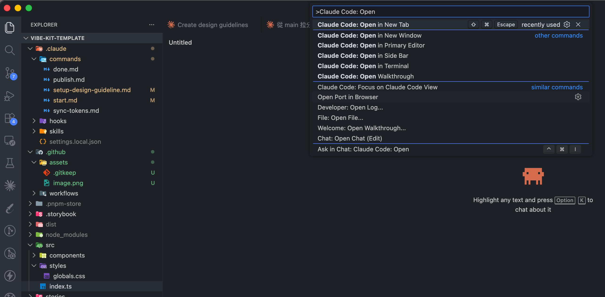
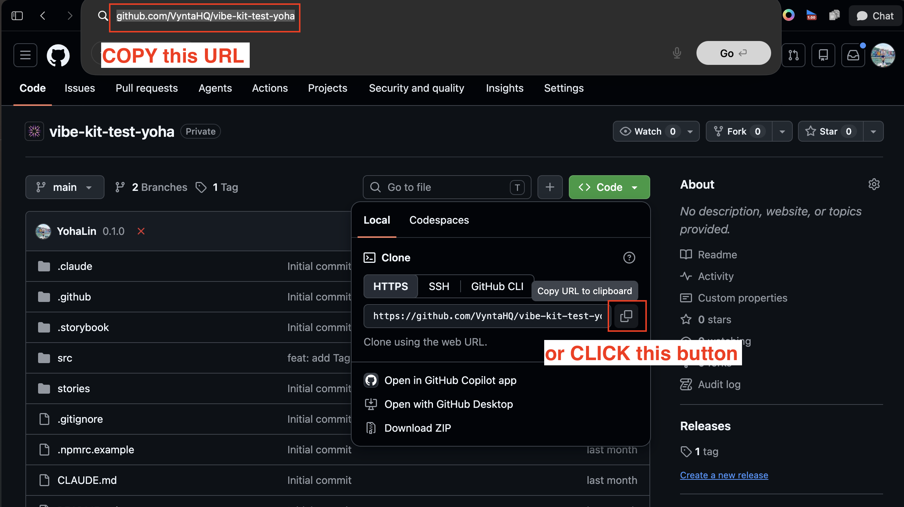
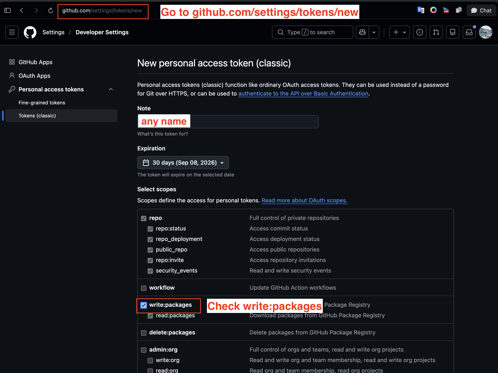
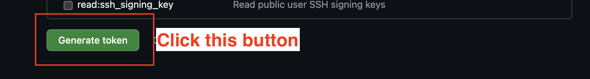
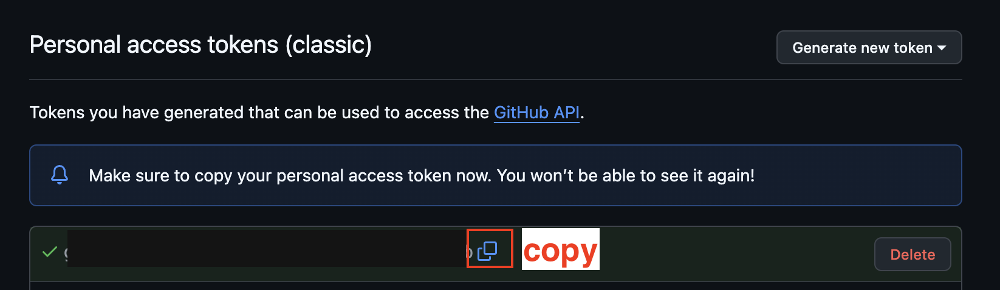

# Component Kit Builder

A template for designers to build their own component library using Claude Code — no coding required.

Create your own copy from this template, let AI generate the components.

---

## Prerequisites

| Tool | Version | Notes |
|------|---------|-------|
| Node.js | 20 or later | [nodejs.org](https://nodejs.org) — choose **LTS** |
| VS Code | Any recent | [code.visualstudio.com](https://code.visualstudio.com) |
| Claude Code | Latest | Install from VS Code Extensions (`anthropic.claude-code`) |
| Claude account | Pro or above | [claude.ai](https://claude.ai) — required to use Claude Code |

> Don't worry about anything else (Git, GitHub CLI, etc.) — the first prompt in Step 1 has Claude check for those and install them for you.

---

## Step 1 — Local Setup

**1. Create your repo from this template**

Go to [github.com/VyntaHQ/component-kit-builder](https://github.com/VyntaHQ/component-kit-builder) and click **Use this template → Create a new repository** in the top-right corner. This creates an independent copy under your own GitHub account — with no shared history and no link back to the original.

> For a step-by-step walkthrough, see GitHub's guide: [Creating a repository from a template](https://docs.github.com/en/repositories/creating-and-managing-repositories/creating-a-repository-from-a-template).

**2. Open in VS Code**

Open VS Code, then go to **File → Open Folder** and select the repo folder.

**3. Open Claude Code**

Press `Cmd+Shift+P` (Mac) or `Ctrl+Shift+P` (Windows) and search for **Claude Code: Open**, or click the Claude icon in the sidebar.



**4. Clone your new repo**

After you create the repo, GitHub takes you straight to its page — your repo's URL is right there in your browser's address bar. Copy it directly from there; it already has your username and repo name filled in, so you don't need to type anything yourself.



In Claude Code, paste this prompt, then paste the URL you just copied in place of `<paste the URL you copied here>`:

```
Please check whether my computer has everything needed to work with a
GitHub repository (Git, GitHub CLI, and anything else required), install
whatever is missing, and help me log in to GitHub if needed. Once that's
ready, clone this repository to my computer:
<paste the URL you copied here>
```

For example, if your address bar shows `https://github.com/VyntaHQ/vibe-kit-test-yoha`, that's the URL you'd paste in.

> **Don't worry about the technical terms in the prompt** — Claude reads it, not you. It will check your computer step by step, tell you in plain language what it's about to install if anything's missing, and ask you to approve each step. Just click **Allow** when it asks — these are safe, standard developer tools.
>
> **If it asks you to log in to GitHub**, it will open a page in your browser — just follow the on-screen steps there.

Claude will clone the repo for you.

**5. Switch to the new folder**

Cloning creates a new folder next to the one you have open — Claude Code won't switch into it automatically. Go to **File → Open Folder** and select the newly cloned folder to continue there.

---

## Step 2 — Start a Working Session

Always run this first before making any changes:

```
/start
```

Claude will sync main, ask what you're working on, and create a feature branch. At the end, it will automatically open Storybook at [http://localhost:6006](http://localhost:6006) — a browser preview where you can see your components live.

> **Heads up:** Claude will ask you which component you're working on today — type a short description and hit Enter to continue. For example: `product card` or `navigation bar`. The flow won't move forward until you answer.

> **Allow permissions when prompted:** Claude may ask for permission to run commands (e.g. installing packages, starting Storybook). click **Allow** — these are safe operations and the flow will stall if you decline.

---

## Step 3 — Do Your Work

Each action requires its own command. Run the relevant command, let Claude finish, then run another one for the next task.

### `/setup-design-guideline`
*(First time only)* Claude will ask about your brand — colors, fonts, dark mode. You can answer with hex values, descriptions, or a Figma screenshot. Claude generates `design-guideline.json` for your confirmation before saving.

> If you're just attaching a file (e.g. a Figma screenshot) and aren't sure what to type along with it, paste this:
> ```
> Use the files I've attached to generate the design guideline.
> ```

If you already have a `design-guideline.json`, attach it when you run the command and Claude will use it directly — no questions asked.

> If anything goes wrong or you need to start over, just run `/setup-design-guideline` again.

Once it's saved, open Storybook → **Foundations → Design Guideline** to see your tokens WYSIWYG:

- Save `design-guideline.json` and Storybook shows the result immediately — no rebuild needed.
- Hover any color swatch to see which palette step it points to.
- A swatch with a ⚠ badge means that token hasn't been applied to the code yet — run `/sync-tokens` and it disappears.

### `/sync-tokens`
Applies `design-guideline.json` to Tailwind. Run this after `/setup-design-guideline`, or any time you update the file.

### `/setup-logo`
*(Optional)* Share your logo file (SVG works best) and Claude saves it into `design-guideline.json`. Open Storybook → **Foundations → Logos** to see it in place of the gray placeholder.

> The template ships with no logo — the Logos page shows an empty placeholder until you run this.

### `/generate-component`
> ⚠️ Only for brand-new components. To modify an existing one, use `/edit-component` instead.

Tell Claude what component you want — what it looks like, what variants or states it has. The more detail you provide, the better the result.

Things to include:
- **Variants** — e.g. primary, secondary, ghost, destructive
- **Sizes** — list every size you need, e.g. `xs`, `sm`, `md`, `lg`, `xl`
- **States** — e.g. default, hover, disabled, loading, active
- **Content** — what goes inside (icon, label, badge, avatar...)
- **Behavior** — e.g. full-width on mobile, icon-only at small sizes

> Example: "I want a Button with three variants: primary (solid), secondary (outlined), and ghost (text only). Sizes: sm, md, lg. States: default, hover, disabled, and loading (show a spinner)."

If the component needs a reusable spacing or radius value (e.g. a consistent card padding), tell Claude to add it as a semantic token in `design-guideline.json` and run `/sync-tokens` again — no need to plan these out ahead of time.

### `/edit-component`
Tell Claude what to change about an existing component.

> Example: "Add a loading spinner to the Button that appears when a `loading` prop is passed."

### `/sync-icons`
Drop icon SVG files into `assets/icons/`, then run this command. Claude turns each one into a ready-to-use icon component under `src/components/Icons/` and adds it to the icon gallery in Storybook → **Components → Icons**.

**Naming your files:** `icon_<name>_<type>.svg` — for example `icon_home.svg` becomes `HomeIcon`, and `icon_home_fill.svg` becomes `HomeFillIcon`. `<type>` is optional (only add it if you have variants of the same icon, like an outline and a filled version).

> If a file doesn't follow that pattern, Claude still converts it — it just uses the filename as-is (e.g. `arrow-right.svg` becomes `ArrowRightIcon`) instead of guessing what you meant.
>
> Removing a file from `assets/icons/` and running this again removes the matching component too.

---

## Step 4 — Save Your Work

When you're done, run:

```
/done
```

Claude commits and pushes the branch. Repeat Steps 2–4 for each new batch of work.

---

## Step 5 — Publish

> **First time only:** Your very first `/publish` includes a one-time setup (publish token, package scope, `.npmrc`) — Claude walks you through it automatically before publishing. See [Setup — Publishing to GitHub Packages](#setup--publishing-to-github-packages) below for details.

When you're ready to release the library, run:

```
/publish
```

Claude will build, bump the version, publish to GitHub Packages, and push a release tag.

**How to choose a version:**

| Version | When to use | Example |
|---------|-------------|---------|
| `patch` | Fixed a bug, tweaked spacing or color | `0.0.1 → 0.0.2` |
| `minor` | Added a new component or new props | `0.0.1 → 0.1.0` |
| `major` | Renamed or removed existing components/props | `0.0.1 → 1.0.0` |

Use `major` only when existing users need to update their code after upgrading.

---

## Reference Commands

| Command | When to use |
|---------|-------------|
| `/setup-design-guideline` | Generate `design-guideline.json` from your brand description |
| `/sync-tokens` | Apply `design-guideline.json` to Tailwind after any updates |
| `/setup-logo` | Save your logo into `design-guideline.json` so it shows on the Logos page |
| `/start` | Sync main, create a feature branch, and start Storybook |
| `/generate-component` | Add a brand-new component (not for editing existing ones) |
| `/edit-component` | Modify an existing component (always use this, not `/generate-component`) |
| `/sync-icons` | Turn SVG files in `assets/icons/` into icon components |
| `/done` | Commit and push the current branch |
| `/publish` | Build, bump version, and release to GitHub Packages |
| `/core-components` | Look up component writing conventions and Design System tokens |
| `/storybook` | Look up how to write Storybook stories |
| `/spec-component` | Write a component spec before generating |
| `/design-guideline-page` | Look up the Design Guideline preview page's structure and conventions |

---

## Preview Components

```bash
npm run storybook
```

Opens Storybook at http://localhost:6006

---

## Setup — Publishing to GitHub Packages

The first time you run `/publish`, it needs a one-time setup — a publish token, a scoped package name, and a filled-in `.npmrc`. Most of this is automatic: `/publish` detects when it's missing and walks you through it step by step, right in the chat.

The one part that's manual is generating the token itself — that has to happen on GitHub's website, in your own logged-in account, so Claude can't do it for you. Here's what that looks like:

**1. Go to [github.com/settings/tokens/new](https://github.com/settings/tokens/new)** — give the token any name you like, and under **Select scopes**, check **only `write:packages`**. Leave everything else (`repo`, `workflow`, `admin:org`, etc.) unchecked — that one box is all `/publish` needs.



**2. Click "Generate token"** at the bottom of the page.



**3. Copy the token immediately** — GitHub only shows it once.



Once you have it copied, run `/publish` — Claude will tell you exactly where to paste it (into `.npmrc`, not in the chat, since it's a secret).

---

## For Frontend Engineers — Installing the Component Library

Throughout the steps below, the scope (`@...`) is whatever the library was published under — an organization name, or the author's GitHub username, **always in all lowercase** (e.g. `VyntaHQ` → `@vyntahq`). Use the actual package name you were given in place of `@your-org/your-library-name`.

### Step 1: Generate a GitHub Personal Access Token

1. Go to [github.com/settings/tokens/new](https://github.com/settings/tokens/new)
2. Select **Classic token**
3. Check `read:packages`
4. Generate and copy the token

### Step 2: Add `.npmrc` to your project root

```
# Organization account
@your-org:registry=https://npm.pkg.github.com
//npm.pkg.github.com/:_authToken=YOUR_TOKEN_HERE

# Personal account (username: janedoe)
@janedoe:registry=https://npm.pkg.github.com
//npm.pkg.github.com/:_authToken=YOUR_TOKEN_HERE
```

Add `.npmrc` to your `.gitignore` so the token is never committed. You only set this up once.

### Step 3: Install

```bash
# Organization account
npm install @your-org/your-library-name@<version>

# Personal account (username: janedoe)
npm install @janedoe/your-library-name@<version>
```

### Step 4: Import styles

```tsx
import '@your-org/your-library-name/styles'
```

### Step 5: Use components

```tsx
import { Button } from '@your-org/your-library-name'

<Button variant="primary">Click me</Button>
```

---

## Credits

`CloseIcon`, `MenuIcon` and `SettingsIcon` in `src/components/Icons/` are [Material Symbols](https://fonts.google.com/icons) by Google, licensed under the [Apache License 2.0](https://www.apache.org/licenses/LICENSE-2.0). No visible attribution is required in products that use them.
